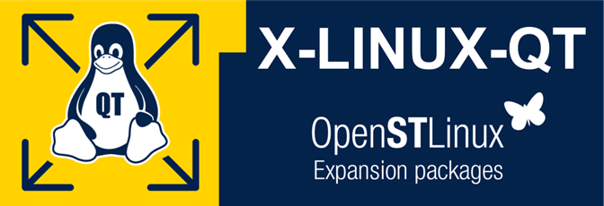

<center>



</center>

X-LINUX-QT is an STM32 MPU OpenSTLinux Expansion Package that targets Qt based application and graphical user interface (GUI) development for the STM32MP25xx series microprocessors. It contains Linux® Qt™ Frameworks, as well as an ST Application Launcher based on Qt™ Framework and application examples to get started with Qt application development.

The Qt framework contains a comprehensive set of highly intuitive and modularized C++ library classes and is loaded with APIs to simplify your application development. Qt produces highly readable, easily maintainable and reusable code with high runtime performance and small footprint – and it's cross-platform.

This expansion package is a complete ecosystem that allow developers working with OpenSTLinux to create Qt based application very easily.

- All-in-one Qt solutions for the entire STM32MPU serie supporting Wayland and Weston.
- Pre-integrated into Linux distribution based on ST environment
- Include Qt frameworks to build UIs and Applications
- Include ST Application Launcher based on Qt framework for MPU devices (see supported platforms list)

# meta-st-x-linux-qt
OpenEmbedded meta layer to install Qt frameworks and tools for the STM32MPU.

## Compatibility
* The X-LINUX-QT OpenSTLinux Expansion Package v2.0.0 is compatible with the Yocto Project™ build systems (mickledore and later versions).
* It is validated using the *_Qt6 OpenEmbedded/Yocto Project layer_* [(*_meta-qt6_*)](https://code.qt.io/yocto/meta-qt6.git) over the OpenSTLinux Distributions v5.1.

## Supported STM32MPU devices
This expansion package is supporting below STM32 MPU boards.
  * STM32MP257F-EV1
  * STM32MP157F-DK2

## Re-generate X-LINUX-QT OpenSTLinux distribution

### Install OpenSTLinux distribution

* Please follow instructions from the wiki article [STM32MP Distribution package](https://wiki.st.com/stm32mpu/wiki/STM32MPU_Distribution_Package)

### Install X-LINUX-QT environment

* Clone the meta-st-x-linux-qt git repository

```
cd <Distribution Package installation directory>/layers/meta-st
git clone -b v2.0.0 https://github.com/STMicroelectronics/meta-st-x-linux-qt.git layers/meta-st/meta-st-x-linux-qt
```

* Clone the meta-qt6 git repository

```
 git clone -b 6.5.3 https://code.qt.io/yocto/meta-qt6.git layers/meta-qt6
```

### Source Yocto/openembedded build environment

```
DISTRO=openstlinux-weston MACHINE=stm32mp2 BSP_DEPENDENCY="layers/meta-qt6 layers/meta-st/meta-st-x-linux-qt" source layers/meta-st/scripts/envsetup.sh
```

### Build the X-LINUX-QT image

```
bitbake st-image-qt package-index
```

### Build the X-LINUX-QT SDK

```
bitbake st-image-qt -c do_populate_sdk
```

## Available frameworks and tools within the X-LINUX-QT expansion package

List of Qt™ 6.5 Modules available in this expansion package:

| Qt Essentials 	| Module            	    | Available  | Description     	                                                                                	|
|:------------------|:--------------------------|:---------:|-------------------------------------------------------------------------------------------------------|
|               	| Qt Core             	    | Y         | Core non-graphical classes used by other modules.                                                    	|
|               	| Qt GUI              	    | Y         | Base classes for graphical user interface (GUI) components. Includes OpenGL.                         	|
|               	| Qt Multimedia       	    | Y         | Classes for audio, video, radio and camera functionality.                                            	|
|               	| Qt Multimedia Widgets	    | Y         | Widget-based classes for implementing multimedia functionality.                                      	|
|               	| Qt Network          	    | Y         | Classes to make network programming easier and more portable.                                        	|
|               	| Qt QML              	    | Y         | Classes for QML and JavaScript languages.                                                            	|
|               	| Qt Quick            	    | Y         | A declarative framework for building highly dynamic applications with custom user interfaces.        	|
|               	| Qt Quick Controls   	    | Y         | Provides lightweight QML types for creating performant user interfaces for desktop, embedded, and mobile devices. These types employ a simple styling architecture and are very efficient.                                                               	|
|               	| Qt Quick Dialogs    	    | Y         | Types for creating and interacting with system dialogs from a Qt Quick application.                  	|
|               	| Qt Quick Layouts    	    | Y         | Layouts are items that are used to arrange Qt Quick 2 based items in the user interface.             	|
|               	| Qt Quick Test       	    | Y         | A unit test framework for QML applications, where the test cases are written as JavaScript functions.	|
|               	| Qt SQL              	    | Y         | Classes for database integration using SQL.                                                       	|
|               	| Qt Test             	    | Y         | Classes for unit testing Qt applications and libraries.                                           	|
|               	| Qt Widgets          	    | Y         | Classes to extend Qt GUI with C++ widgets.                                                        	|

| Qt Add-Ons       	| Module                	| Available | Description     	                                                                                	|
|:------------------|:--------------------------|:---------:|:------------------------------------------------------------------------------------------------------|
|               	| Qt 3D						| Y         | Functionality for near-realtime simulation systems with support for 2D and 3D rendering.          	|
|               	| Qt 5 Core Compatibility APIs	| Y         | Qt Core APIs that were in Qt 5 but not Qt 6.                                         	|
|               	| Qt Android Extras			| N         | Provides platform-specific APIs for Android.                                                      	|
|               	| Qt Bluetooth				| N         | Provides access to Bluetooth hardware.                                                            	|
|               	| Qt Charts					| Y         | UI Components for displaying visually pleasing charts, driven by static or dynamic data models.   	|
|               	| Qt Concurrent				| Y         | Classes for writing multi-threaded programs without using low-level threading primitives.         	|
|               	| Qt Data Visualization		| N         | UI Components for creating stunning 3D data visualizations.                                       	|
|               	| Qt Help					| N         | Classes for integrating documentation into applications, similar to Qt Assistant.                 	|
|               	| Qt Image Formats			| Y         | Plugins for additional image formats: TIFF, MNG, TGA, WBMP.                                       	|
|               	| Qt Lottie Animation		| N         | A QML API for rendering graphics and animations in JSON format, exported by the Bodymovin plugin for Adobe® After Effects.  	|
|               	| Qt Network Authorization	| N         | Provides support for OAuth-based authorization to online services.                                	|
|               	| Qt Multimedia				| N         | A rich set of QML types and C++ classes to handle multimedia content. Also includes APIs to handle camera access. 	|
|               	| Qt NFC					| N         | Provides access to Near-Field communication (NFC) hardware.                                       	|
|               	| Qt OPC UA				| N         | Protocol for data modeling and exchange of data in industrial applications.                       	|
|               	| Qt OpenGL 				| Y         | OpenGL support classes. Deprecated in favor of the QOpenGL* classes in the Qt GUI module.         	|
|               	| Qt PDF					| N         | Classes and functions for rendering PDF documents.                                                	|
|               	| Qt Positioning			| Y         | Provides access to position, satellite and area monitoring classes.                               	|
|               	| Qt Print Support			| Y         | Classes to make printing easier and more portable.                                                	|
|               	| Qt Quick Controls 1 		| Y         | Reusable Qt Quick based UI controls to create classic desktop-style user interfaces. Deprecated in favor of Qt Quick Controls 2, which are better and easier to use.  	|
|               	| Qt Quick Extras	All		| Y         | Provides a specialized set of controls that can be used to build interfaces in Qt Quick.          	|
|               	| Qt Quick Timeline			| Y         | Enables keyframe-based animations and parameterization.                                           	|
|               	| Qt Quick Widgets			| Y         | Provides a C++ widget class for displaying a Qt Quick user interface.                             	|
|               	| Qt Quick 3D				| Y         | Provides a high-level API for creating 3D content or UIs based on Qt Quick.                       	|
|               	| Qt Quick WebGL			| N         | Provides a platform plugin that allows streaming Qt Quick user interfaces over the network using WebGL™.  	|
|               	| Qt Remote Objects			| Y         | Provides an easy to use mechanism for sharing a QObject's API (Properties/Signals/Slots) between processes or devices.  	|
|               	| Qt Script 				| N         | Classes for making Qt applications scriptable. Deprecated in favor of the QJS* classes in the Qt QML module.  	|
|               	| Qt SCXML					| Y         | Provides classes and tools for creating state machines from SCXML files and embedding them in applications.   	|
|               	| Qt Script Tools 			| Y         | Additional components for applications that use Qt Script.                                        	|
|               	| Qt Sensors				| N         | Provides access to sensor hardware and motion gesture recognition.                                	|
|               	| Qt Serial Bus				| N         | Provides access to serial industrial bus interface. Currently the module supports the CAN bus and Modbus protocols.  	|
|               	| Qt Serial Port			| Y         | Provides access to hardware and virtual serial ports.                                             	|
|               	| Qt Speech					| N         | Provides support for accessibility features such as text-to-speech.                               	|
|               	| Qt SVG					| Y         | Classes for displaying the contents of SVG files. Supports a subset of the SVG 1.2 Tiny standard. 	|
|               	| Qt UI Tools				| N         | Classes for loading QWidget based forms created in Qt Designer dynamically, at runtime.           	|
|               	| Qt Virtual Keyboard		| Y         | A framework for implementing different input methods as well as a QML virtual keyboard. Supports localized keyboard layouts and custom visual themes.  	|
|               	| Qt WebChannel				| N         | Provides access to QObject or QML objects from HTML clients for seamless integration of Qt applications with HTML/JavaScript clients.  	|
|               	| Qt WebEngine				| N         | Classes and functions for embedding web content in applications using the Chromium browser project. 	|
|               	| Qt WebKit  				| N         | Port of WebKit on top of Qt to support rendering webpages and execute JavaScript code.            	|
|               	| Qt WebSockets				| N         | Provides WebSocket communication compliant with RFC 6455.                                         	|
|               	| Qt WebView				| N         | Displays web content in a QML application by using APIs native to the platform, without the need to include a full web browser stack.  	|
|               	| Qt Wayland Compositor		| Y         | Provides a framework to develop a Wayland compositor.                                             	|
|               	| Qt for WebAssembly		| N         | A platform target to compile Qt applications for the web browsers using WebAssembly.              	|
|               	| Qt Windows Extras			| N         | Provides platform-specific APIs for Windows.                                                      	|
|               	| Qt X11 Extras				| N         | Provides platform-specific APIs for X11.                                                          	|
|               	| Qt XML					| Y         | C++ implementations of SAX and DOM.                                                               	|
|               	| Qt XML Patterns 			| Y         | Support for XPath, XQuery, XSLT and XML schema validation.                                        	|
|               	| Qt Data Compression 		| Y         | Provides Data Compression Library (zlib) support usied in Qt Core and developpement tools.        	|

## Further information on [Qt 6.5 All Modules](https://doc.qt.io/qt-6.5/qtmodules.html)

* <https://doc.qt.io/qt-6.5/qtmodules.html>

## Further information on how to install and how to use X-LINUX-QT

* [X-LINUX-QT v2.0.0 expansion package](https://wiki.st.com/stm32mpu/wiki/X-LINUX-QT_Expansion_Package)

## Further information on Qt 6.5 Framework and Tools

* <https://doc.qt.io/qt-6.5/>

## Further information on Qt Group and STMicroelectronics partnership

* <https://www.st.com/content/st_com/en/partner/partner-program/partnerpage/Qt.html>
* <https://www.qt.io/partners/stmicroelectronics>

