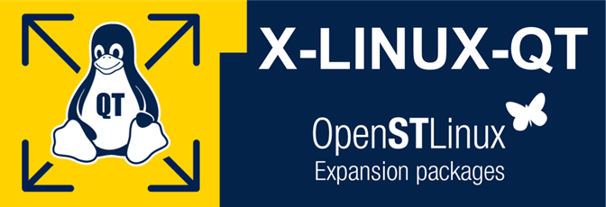

<center>



</center>

X-LINUX-QT is an STM32 MPU OpenSTLinux Expansion Package that targets Qt based application and graphical user interface (GUI) development for the STM32MP25xx series microprocessors. It contains Linux® Qt™ Frameworks, as well as an ST Application Launcher based on Qt™ Framework and application examples to get started with Qt application development.

The Qt framework contains a comprehensive set of highly intuitive and modularized C++ library classes and is loaded with APIs to simplify your application development. Qt produces highly readable, easily maintainable and reusable code with high runtime performance and small footprint – and it's cross-platform.

This expansion package is a complete ecosystem that allow developers working with OpenSTLinux to create Qt based application very easily.

- All-in-one Qt solutions for the entire STM32MPU serie supporting Wayland and Weston.
- Pre-integrated into Linux distribution based on ST environment
- Include Qt frameworks to build UIs and Applications
- Include ST Application Launcher based on Qt framework for MPU devices (see supported platforms list)

# meta-st-x-linux-qt
OpenEmbedded meta layer to install Qt frameworks and tools for the STM32MPU.

## Compatibility
* The X-LINUX-QT OpenSTLinux Expansion Package v2.3.0 is compatible with the Yocto Project™ build systems (scarthgap).
* It is validated using the *_Qt6 OpenEmbedded/Yocto Project layer_* [(*_meta-qt6_*)](https://code.qt.io/yocto/meta-qt6.git) over the OpenSTLinux Distributions v6.2.x

## Supported STM32MPU devices
This expansion package is supporting below STM32 MPU boards.
  * STM32MP257F-EV1
  * STM32MP257F-DK
  * STM32MP215F-DK
  * STM32MP157F-DK2
  * STM32MP135F-DK

## Re-generate X-LINUX-QT OpenSTLinux distribution

### Install OpenSTLinux distribution

* Please follow instructions from the wiki article [STM32MP Distribution package](https://wiki.st.com/stm32mpu/wiki/STM32MPU_Distribution_Package)

### Install X-LINUX-QT environment

* Please follow instructions from the wiki article [STM32MP X-LINUX-QT Distribution package](https://wiki.st.com/stm32mpu/wiki/X-LINUX-QT_Distribution_Package)

* Clone the meta-st-x-linux-qt git repository

```
cd <Distribution Package installation directory>
git clone -b v2.3.0 https://github.com/STMicroelectronics/meta-st-x-linux-qt.git layers/meta-st/meta-st-x-linux-qt
```

* Clone the meta-qt6 git repository

```
 git clone -b 6.8.3 https://code.qt.io/yocto/meta-qt6.git layers/meta-qt6
```


### Source Yocto/openembedded build environment

* For a new environment
```
DISTRO=openstlinux-weston MACHINE=stm32mp2 BSP_DEPENDENCY="layers/meta-qt6 layers/meta-st/meta-st-x-linux-qt" source layers/meta-st/scripts/envsetup.sh
```

* For an already installed environment
```
source layers/meta-st/scripts/envsetup.sh
bitbake-layers add-layer ../layers/meta-qt6 ../layers/meta-st/meta-st-x-linux-qt
```

### Build the X-LINUX-QT image

```
bitbake st-image-qt package-index
```

### Build the X-LINUX-QT SDK

```
bitbake st-image-qt -c do_populate_sdk
```

## Further information on how to install and how to use X-LINUX-QT

* [X-LINUX-QT v2.3.0 expansion package](https://wiki.st.com/stm32mpu/wiki/X-LINUX-QT_Expansion_Package)

## Further information on [Qt 6.8 All Modules](https://doc.qt.io/qt-6.8/qtmodules.html)

* <https://doc.qt.io/qt-6.8/qtmodules.html>

## Further information on Qt 6.8 Framework and Tools

* <https://doc.qt.io/qt-6.8/>

## Further information on Qt Group and STMicroelectronics partnership

* <https://www.st.com/content/st_com/en/partner/partner-program/partnerpage/Qt.html>
* <https://www.qt.io/partners/stmicroelectronics>

